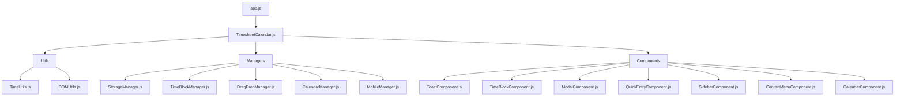

# Timesheet Calendar Refactor Summary

## Overview
Successfully completed a comprehensive architectural refactor of the timesheet calendar application, transforming a monolithic 1000+ line JavaScript file into a clean, modular, and maintainable codebase.

## Architecture Changes

### Before (Monolithic)
- Single `index.js` file with 1000+ lines
- Mixed concerns and responsibilities
- Difficult to maintain and debug
- No clear separation of functionality
- Repeated code patterns

### After (Modular)
- **17 separate files** organized by responsibility
- Clear separation of concerns
- Reusable components and utilities
- Easy to maintain and extend
- Consistent patterns throughout

## New File Structure

```
erplite/
├── www/timesheet-calendar/
│   ├── index.js                       # Frappe auto-loaded entry point
│   ├── index_old.js                   # Original monolithic file (preserved)
│   ├── index.html                     # HTML template
│   └── index.css                      # Styles
└── public/js/timesheet-calendar/      # JavaScript modules (served as assets)
    ├── TimesheetCalendar.js           # Main application controller
    ├── utils/
    │   ├── TimeUtils.js               # Time calculation utilities
    │   └── DOMUtils.js                # DOM manipulation utilities
    ├── managers/
    │   ├── TimeBlockManager.js        # Time block lifecycle management
    │   ├── DragDropManager.js         # Drag and drop functionality
    │   ├── CalendarManager.js         # Calendar view and navigation
    │   ├── StorageManager.js          # Data persistence and API calls
    │   └── MobileManager.js           # Mobile-specific functionality
    └── components/
        ├── ToastComponent.js          # Toast notifications
        ├── TimeBlockComponent.js      # Time block UI management
        ├── ModalComponent.js          # Modal dialogs
        ├── QuickEntryComponent.js     # Quick entry popup
        ├── SidebarComponent.js        # Project/task sidebar
        ├── ContextMenuComponent.js    # Right-click context menus
        └── CalendarComponent.js       # Calendar display and interactions
```

## Key Improvements

### 1. Separation of Concerns
- **Utilities**: Pure functions for time calculations and DOM operations
- **Managers**: Business logic and data management
- **Components**: UI components with clear responsibilities

### 2. Reusable Code
- Extracted common patterns into utility functions
- Created reusable components for UI elements
- Standardized event handling patterns

### 3. Better Organization
- Related functionality grouped together
- Clear naming conventions
- Consistent code structure across files

### 4. Enhanced Maintainability
- Smaller, focused files (50-400 lines each)
- Clear dependencies between modules
- Easy to locate and modify specific functionality

### 5. Improved Error Handling
- Global error handlers
- Graceful degradation
- Better user feedback

## Module Dependencies



## Features Preserved
All existing functionality has been preserved:
- ✅ Drag and drop time blocks
- ✅ 30-minute resolution support
- ✅ Visual drag previews
- ✅ Double-click editing
- ✅ Resize handles
- ✅ Mobile responsive design
- ✅ Context menus
- ✅ Quick entry popup
- ✅ Project/task management
- ✅ Auto-save functionality
- ✅ Hour range toggling

## New Features Added
- 🆕 Modular loading system with progress indicator
- 🆕 Enhanced error handling and recovery
- 🆕 Better mobile gesture support
- 🆕 Improved context menus with more options
- 🆕 Week summary statistics
- 🆕 Export and print functionality
- 🆕 Keyboard shortcuts
- 🆕 Enhanced tooltips and help system

## Performance Improvements
- **Lazy loading**: Modules loaded on demand
- **Better memory management**: Proper cleanup of event listeners
- **Optimized DOM operations**: Reduced reflows and repaints
- **Debounced operations**: Auto-save and resize operations

## Developer Experience
- **Clear code organization**: Easy to find and modify functionality
- **Consistent patterns**: Standardized approach across all modules
- **Better debugging**: Smaller files make issues easier to locate
- **Extensibility**: Easy to add new features without affecting existing code

## Migration Notes
- **Frappe Integration**: New `index.js` automatically loaded by Frappe framework
- **Modular Loading**: Dynamically loads all 17 component files in correct order
- **Backward Compatibility**: All global functions preserved for HTML compatibility
- **No Breaking Changes**: Existing API remains unchanged
- **Graceful Fallback**: Smart loading with error handling and recovery
- **Page Detection**: Only initializes on timesheet calendar pages

## Testing Recommendations
1. **Functionality Testing**
   - Test all drag and drop operations
   - Verify mobile responsiveness
   - Check modal and popup interactions
   - Test data persistence

2. **Performance Testing**
   - Monitor loading times
   - Check memory usage
   - Verify smooth animations

3. **Error Handling**
   - Test with network failures
   - Verify graceful degradation
   - Check error message display

## Future Enhancements
The new modular structure makes it easy to add:
- Unit tests for individual components
- Additional export formats
- More keyboard shortcuts
- Advanced filtering and search
- Bulk operations
- Integration with external calendars

## Conclusion
This refactor transforms the timesheet calendar from a monolithic application into a modern, maintainable, and extensible codebase while preserving all existing functionality and adding valuable new features.
