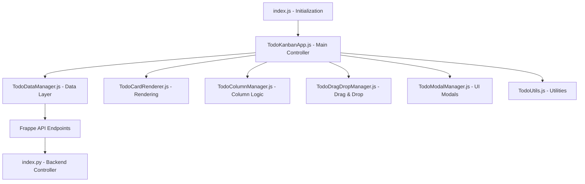

# Todo Kanban Application Documentation

## Overview

The Todo Kanban application is a modern, drag-and-drop task management system built within the ERPLite Frappe framework. It provides an intuitive kanban board interface for managing todos across different workflow stages with comprehensive user management and permission controls.

## File Structure

```
erplite/www/todo/
├── index.html          # Main HTML template with Jinja2 templating
├── index.py            # Python backend controller and API endpoints
├── index.js            # JavaScript initialization and script loading
├── index.css           # Complete CSS styling and responsive design
└── README.md           # This documentation file

erplite/public/js/todo/
├── TodoKanbanApp.js                    # Main application controller
├── columns/TodoColumnManager.js        # Column management and organization
├── data/TodoDataManager.js             # Data operations and API calls
├── dragdrop/TodoDragDropManager.js     # Drag and drop functionality
├── modals/TodoModalManager.js          # Modal dialogs and forms
├── rendering/TodoCardRenderer.js       # Card rendering and display logic
└── utils/TodoUtils.js                  # Utility functions and helpers
```

## Architecture Overview

### Frontend Architecture

The application follows a modular JavaScript architecture with clear separation of concerns:



### Backend Architecture

The Python backend provides secure API endpoints and data processing:

```mermaid
graph TD
    A[index.py - Main Controller] --> B[get_context() - Page Data]
    A --> C[API Endpoints]
    
    C --> D[@frappe.whitelist get_todos()]
    C --> E[@frappe.whitelist create_todo()]
    C --> F[@frappe.whitelist update_todo()]
    C --> G[@frappe.whitelist delete_todo()]
    C --> H[@frappe.whitelist update_todo_status()]
    
    B --> I[Permission Checks]
    B --> J[User Data Processing]
    B --> K[Todo Data Processing]
```

## Component Details

### 1. HTML Template (`index.html`)

**Structure:**
- Extends Frappe's `templates/web.html` base template
- Includes app navigation and responsive layout
- Defines kanban board with three main columns plus actions column
- Contains modal templates for todo creation/editing
- Includes confirmation dialogs and toast notifications

**Key Sections:**
```html
<!-- Header with title, user filter, and action buttons -->
<div class="kanban-header">
    <!-- Title and subtitle -->
    <!-- User filter dropdown -->
    <!-- Add Todo and Refresh buttons -->
</div>

<!-- Main kanban board with columns -->
<div class="kanban-board">
    <!-- Backlog Column -->
    <!-- To Do Column -->
    <!-- In Progress Column -->
    <!-- Actions Column (Complete/Cancel zones) -->
</div>

<!-- Modal templates and overlays -->
<!-- JavaScript data injection -->
```

**Card Template Structure:**
```html
<!-- Todo Card Template with Collapsed/Expanded Views -->
<template id="todo-card-template">
    <div class="todo-card collapsed">
        <!-- Collapsed View (Single Line) -->
        <div class="card-collapsed-view">
            <div class="collapsed-left">
                <div class="priority-indicator"></div>
                <div class="card-description-preview"></div>
            </div>
            <div class="collapsed-right">
                <div class="due-date-indicator"></div>
                <div class="user-indicator">
                    <div class="user-avatar-small"></div>
                </div>
                <button class="expand-btn">
                    <i class="mdi mdi-chevron-down"></i>
                </button>
            </div>
        </div>

        <!-- Expanded View (Full Details) -->
        <div class="card-expanded-view">
            <!-- Full card header, body, and footer -->
        </div>
    </div>
</template>
```

### 2. Python Backend (`index.py`)

**Main Functions:**

#### `get_context(context)`
- Handles page initialization and data preparation
- Implements security checks (guest user protection)
- Determines user permissions (manager vs regular user)
- Fetches and processes todo data
- Groups todos by columns for frontend consumption

#### API Endpoints:
- `get_todos()` - Fetch todos with permission filtering
- `create_todo()` - Create new todo with validation
- `update_todo()` - Update todo details with permission checks
- `delete_todo()` - Delete todo with permission validation
- `update_todo_status()` - Move todos between columns

**Security Features:**
- Role-based access control
- Permission validation on all operations
- Input sanitization and validation
- Error logging and handling

### 3. JavaScript Architecture

#### Main Controller (`TodoKanbanApp.js`)
- Orchestrates all other components
- Manages application state
- Handles user interactions
- Coordinates data flow between components

#### Data Manager (`TodoDataManager.js`)
- Handles all API communications
- Manages local data state
- Implements caching strategies
- Provides data transformation utilities

#### Card Renderer (`TodoCardRenderer.js`)
- Renders todo cards with collapsed/expanded views
- Handles inline editing functionality
- Manages card state and updates
- Implements card interaction handlers
- **New**: Supports dual-view rendering (collapsed and expanded)

#### Column Manager (`TodoColumnManager.js`)
- Manages column state and organization
- Handles column-specific operations
- Updates column counts and states
- Manages quick-add functionality

#### Drag & Drop Manager (`TodoDragDropManager.js`)
- Implements drag and drop functionality
- Handles visual feedback during dragging
- Manages drop zone interactions
- Coordinates with backend for status updates

#### Modal Manager (`TodoModalManager.js`)
- Manages all modal dialogs
- Handles form validation and submission
- Implements modal state management
- Provides user feedback and error handling

### 4. CSS Styling (`index.css`)

**Design System:**
- CSS custom properties for consistent theming
- Modern flexbox and grid layouts
- Comprehensive responsive design
- Smooth animations and transitions
- Accessibility-focused styling

**Key Features:**
- Mobile-first responsive design
- Dark mode preparation
- Print stylesheet optimization
- Custom scrollbar styling
- Toast notification system
- Loading state animations
- **New**: Collapsed/expanded card transitions

**Card State Styling:**
```css
/* Collapsed Card State */
.todo-card.collapsed {
    padding: 0.75rem;
    min-height: auto;
}

.todo-card.collapsed .card-expanded-view {
    display: none;
}

.todo-card.collapsed .card-collapsed-view {
    display: flex;
}

/* Expanded Card State */
.todo-card.expanded {
    padding: 1rem;
}

.todo-card.expanded .card-collapsed-view {
    display: none;
}

.todo-card.expanded .card-expanded-view {
    display: block;
}
```

## Data Flow

### Page Load Process
1. **Server-side**: `get_context()` prepares initial data
2. **Client-side**: `index.js` loads JavaScript modules
3. **Initialization**: `TodoKanbanApp` initializes all managers
4. **Rendering**: Cards are rendered in collapsed state by default
5. **Event Binding**: All interactions are bound and ready

### User Interaction Flow
1. **User Action** (drag, click, form submission, expand/collapse)
2. **Event Handler** captures and validates action
3. **Data Manager** processes and sends API request
4. **Backend** validates, processes, and responds
5. **Frontend** updates UI based on response
6. **User Feedback** via toast notifications or visual updates

### Card Expand/Collapse Flow
1. **User clicks card** or expand/collapse button
2. **handleCardClick()** determines current state
3. **expandCard()** or **collapseCard()** function called
4. **CSS classes toggled** for smooth transition
5. **Button icons updated** to reflect new state

## Features

### Core Functionality
- **Kanban Board**: Three-stage workflow (Backlog → To Do → In Progress)
- **Drag & Drop**: Intuitive card movement between columns
- **Quick Add**: Inline todo creation in each column
- **Action Zones**: Complete and Cancel drop zones
- **User Management**: Assignment and filtering capabilities
- **Priority System**: Visual priority indicators and management
- **Due Dates**: Date tracking with overdue highlighting

### Advanced Features
- **Collapsed/Expanded Cards**: Space-efficient single-line view with expandable details
- **Inline Editing**: Click-to-edit descriptions
- **Interactive Dropdowns**: Direct priority and assignment changes
- **Responsive Design**: Mobile and tablet optimized
- **Keyboard Shortcuts**: Power user functionality
- **Real-time Updates**: Automatic refresh on visibility change
- **Error Handling**: Comprehensive error management
- **Loading States**: Professional loading indicators

### Card View States

#### Collapsed View (Default)
- **Single line display** for maximum space efficiency
- **Priority indicator**: Color-coded dot showing priority level
- **Description preview**: Truncated task description
- **Due date indicator**: Compact date display with overdue highlighting
- **User avatar**: Small avatar showing assigned user
- **Expand button**: Chevron down icon to expand card

#### Expanded View (On-demand)
- **Full card details** with all interactive elements
- **Priority dropdown**: Change priority directly
- **Due date picker**: Set or modify due dates
- **Description editing**: Full inline text editing
- **User assignment**: Dropdown for reassigning tasks
- **Action buttons**: Edit and delete options
- **Collapse button**: Chevron up icon to collapse card

### Permission System
- **Guest Protection**: Prevents unauthorized access
- **Role-based Visibility**: Managers see all todos, users see only assigned
- **Operation Permissions**: CRUD operations respect user roles
- **Secure API**: All endpoints validate permissions

## Usage Examples

### Card Interaction
```javascript
// Expand a card programmatically
const card = document.querySelector('[data-todo-id="TODO-001"]');
expandCard(card);

// Collapse a card programmatically
collapseCard(card);

// Toggle card state
if (card.classList.contains('collapsed')) {
    expandCard(card);
} else {
    collapseCard(card);
}
```

### Creating a Todo
```javascript
// Via quick-add input
document.querySelector('.quick-add-input').value = 'New task';
// Press Enter to create

// Via modal
todoKanban.showAddTodoModal();
// Fill form and submit
```

### Moving Todos
```javascript
// Drag and drop between columns
// Or drag to action zones for completion/cancellation

// Programmatic status update
todoKanban.dataManager.updateTodoStatus(todoId, 'Open', 'progress');
```

### Filtering
```javascript
// Filter by user
document.getElementById('userFilter').value = 'user@example.com';
todoKanban.filterTodos();
```

## Customization

### Adding New Columns
1. Update HTML template with new column structure
2. Modify CSS for additional column styling
3. Update JavaScript column mapping
4. Extend backend status handling

### Custom Fields
1. Extend Todo doctype in Frappe
2. Update form templates in HTML
3. Modify card rendering logic
4. Update API endpoints for new fields

### Styling Customization
- Modify CSS custom properties in `:root`
- Update color scheme variables
- Adjust responsive breakpoints
- Customize animation timings
- Modify card transition effects

### Card View Customization
```css
/* Customize collapsed card height */
.todo-card.collapsed {
    min-height: 3rem; /* Adjust as needed */
}

/* Customize transition speed */
.todo-card {
    transition: all 0.5s ease; /* Slower transition */
}

/* Customize priority indicators */
.priority-indicator.high {
    background: #your-color;
    box-shadow: 0 0 4px rgba(239, 68, 68, 0.5);
}
```

## Performance Considerations

### Optimization Strategies
- **Lazy Loading**: Scripts loaded on demand
- **Event Delegation**: Efficient event handling
- **Debounced Updates**: Prevents excessive API calls
- **Local Caching**: Reduces server requests
- **Responsive Images**: Optimized for different screen sizes
- **Card Virtualization**: Efficient rendering of large card lists

### Scalability
- Modular architecture supports feature additions
- Component-based design enables easy maintenance
- Separation of concerns allows independent updates
- API design supports future enhancements
- Collapsed view improves performance with many cards

## Browser Support

- **Modern Browsers**: Chrome 80+, Firefox 75+, Safari 13+, Edge 80+
- **Mobile**: iOS Safari 13+, Chrome Mobile 80+
- **Features Used**: CSS Grid, Flexbox, ES6+, Fetch API, CSS Custom Properties, CSS Transitions

## Development Guidelines

### Code Style
- Use consistent indentation (2 spaces)
- Follow JavaScript ES6+ conventions
- Maintain CSS BEM-like naming where applicable
- Document complex functions and logic

### Testing Recommendations
- Test drag and drop functionality across browsers
- Verify responsive design on various screen sizes
- Test permission system with different user roles
- Validate form submissions and error handling
- **Test card expand/collapse on different devices**
- **Verify smooth transitions and animations**

### Deployment Notes
- Ensure all JavaScript files are properly minified
- Verify CSS custom properties fallbacks
- Test with actual Frappe user roles and permissions
- Monitor performance with realistic data volumes
- **Test card performance with large numbers of todos**

## Troubleshooting

### Common Issues
1. **Scripts not loading**: Check file paths and server configuration
2. **Drag and drop not working**: Verify event handlers are bound
3. **Permission errors**: Check user roles and API permissions
4. **Styling issues**: Verify CSS custom properties support
5. **Cards not expanding/collapsing**: Check JavaScript console for errors
6. **Transition issues**: Verify CSS transition support

### Debug Mode
Enable console logging by setting:
```javascript
window.todoKanbanDebug = true;
```

### Card-specific Debugging
```javascript
// Debug card state
const card = document.querySelector('[data-todo-id="TODO-001"]');
console.log('Card state:', {
    collapsed: card.classList.contains('collapsed'),
    expanded: card.classList.contains('expanded'),
    collapsedView: card.querySelector('.card-collapsed-view').style.display,
    expandedView: card.querySelector('.card-expanded-view').style.display
});
```

## Recent Enhancements

### Collapsed/Expanded Card Feature
- **Space Efficiency**: Cards now default to a compact single-line view
- **On-demand Details**: Click to expand for full editing capabilities
- **Smooth Transitions**: CSS-powered animations for state changes
- **Preserved Functionality**: All existing features work in both states
- **Mobile Optimized**: Improved experience on smaller screens
- **Performance Boost**: Reduced DOM complexity with collapsed view

This comprehensive documentation provides a complete understanding of the Todo Kanban application's structure, functionality, and implementation details, including the new space-efficient collapsed/expanded card system.
